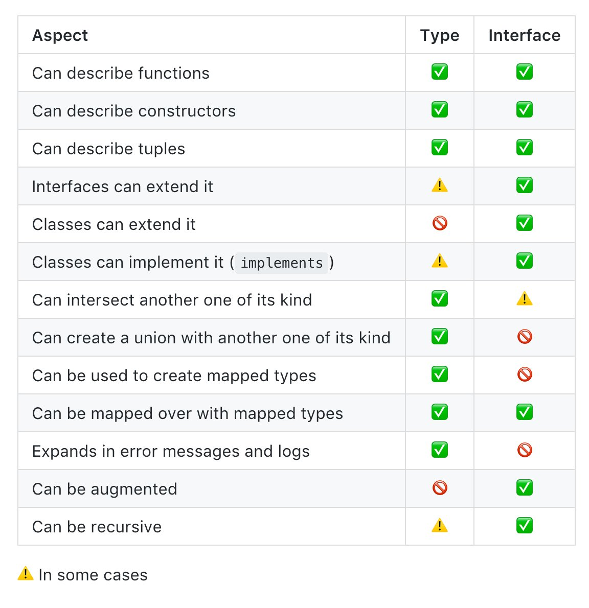

# React and TypeScript Projects

## 01. Introduction

TypeScript with React components
TypeScript details
Patterns in React

TypeScript sales pitch

Type checking in compile time
Autocomplete
More maintainable for larger code base
Contribute the quality of code base overtime

[Course URL](https://fem-react-typescript.vercel.app/)

## 02. React Component with TypeScript

file extension => .tsx

TypeScript tries its hardest to stay out of your way. If you find yourself out of the box, doing a ton of typing, that's probably an anti pattern. because of type inference

any => any type

can use PropTypes for JavaScript

if typescript can figure out, can leave it. But if typescript cannot figure out, need to specify types

typescript can check all files related with changes and also provide related methods for each data type. eg string for string methods

typescript can save the number of unit tests.

ts.configs allowJS for migrating JS to TS

JavaScript and TypeScript can live together pretty nicely.

```ts
type Props = {
  property: type;
};
```

## 03. Typing Components Exercise

It's convention to just take the name of components and tack on -Props on to the end.

avoid any => Any is infectious, anything that any touches basically becomes any

learning through doing

events are not equal, hover the elements to get the props type

typescript provides implicit documentation for pubic api

1. string,
2. number,
3. boolean,
4. string[],
5. string | number,
6. object (placeholder)
7. {} (can have any properties or values)
8. { id: string, title: string }
9. { id: string, title: string }[]
10. type
11. { key: string}: string
12. onChange(id: number): void
13. add(a: number, b: number): number
14. optional?: number
15. & intercept

Typescript uses **Structural Typing**, as long as the object that conforms to the shape, it is good to go,
Typescript only looks the structural of object

React comes with the whole bunch of type definitions for common things
Tell typescript about the types if it cannot figure it out itself

## 04. Typing Component Children Exercise

React.PropsWithChildren type from react which accepts generic for other props

React.ComponentPropsWithoutRef

React.ComponentPropsWithRef

[https://solverfox.dev/writing/no-implicit-children/](https://solverfox.dev/writing/no-implicit-children/)



```ts
function add(a: number, ...otherProps: number[]) {}
```

## 05. Typing Component State

- JSX.Element
- JSX.Element | JSX.Element[]
- React.ReactNode
- React.ReactChildren
- React.ReactChild[]
- React.ReactChild

JSX.Element => single child
JSX.Element[] => does not accept text as child elements, Text in JSX has the type 'string', but the expected type of 'children' is 'Element[], requires multiple children
JSX.Element | JSX.Element[] => does not accept text as child elements, Text in JSX has the type 'string'
React.ReactChild => single child of type 'ReactChild', subset of React.ReactNode, does not include Portal
React.ReactChild[] => requires multiple children of type 'ReactChild'
React.Children => is not a type
React.ReactNode => best solution for React children type, it supports all things

useState is really a wrapper around useReducer

use function setter for race condition of setState

create new function outside of component for function setter to get easily tested

## 06. Typing Component State Exercise

event.target.valueAsNumber

useEffect function return a clean up function or undefined

React.CSSProperties => type of inline style object, catches misspell of css style properties
Props can have default values

## 07. Fetching API Data

[https://miragejs.com/](https://miragejs.com/)

default data or generic type in useState for api data

typescript also analyzes the code base and code path

two states => the one we know and the one from api

for the one we know, we don't need to add type declarations

for the one from api, we need to give type of api response data and default type (null)
useState<Type | Default>()

## 08. Fetching API Data Exercise

for array, can use empty array

any => anything
unknown => don't know what it is
never => isn't anything

React age old problem => passing down to children

useEffect expects function signature that returns void or Destructor

setTimeout and setInterval return numbers

onChange: ChangeEventHandler<HTMLInputElement>;

onSubmit: FormEventHandler<HTMLFormElement>;

## 09. Passing State Methods to Components

class-based components two types in generic, props and state, <Props, State>

react provides relevant types for each DOM event, and tools provide information for that
eg. for input change event => React.ChangeEvent<HTMLInputElement>,
for form submit event => React.FormEvent<HTMLFormElement>

typescript can also catch type cohesion of html input elements

## 10. Typing Reducers

if event handler is inline function, typescript can infer the type of the event, no need to declare

useState is just an abstraction of a useReducer

useReducer is light version of Redux
 
use useReducer for many useState, state are depending on each other and deriving state

reducer is just a pure javascript function which takes two arguments: state and action and returns new state based on that action

can create useState using useReducer

ReturnType<typeof reducer> is for figuring out type of useReducer state

can import Dispatch type in React => React.Dispatch<> to Dispatch<>

## 11. Reducers with Explicit any

no need to give a type if value has default value

reducers follow the same rule as React which is everything's got to be immutable

In typescript, types can intercept with each others, meaning new type can be created with the combination of two other types

Redux is an implementation of flux

Redux action has type and payload

reducer is pure function and it is very testable

one any can cost all type safety due to its butterfly effects

eg. type c = type a & type b, & meanings intercept

useReducer is super helpful for more complicated state management

if we define a type in reducer, typescript automatically defines type in useReducer function state,
also in dispatch function, if we define a type in action, dispatch function automatically defines its type in useReducer function

typescript saves some kinda unit tests

snowballing means the consequences of changing, typescript helps for this

if there is an optional field in type, it might become some problem in reducer, so dividing two action for optional one is better

typescript helps the intent of code flow for future proof

## 12. Adding Types to Reducer Actions

typescript reduces mental capacity for code complexity

typescript knows no need default case if all cases are handled

typescript provides autocomplete + static code analysis

## 13. Creating Actions for colorReducer

color-convert

typescript protect from lots of silly mistakes, but not ones that are totally legal and legit JavaScript

## 14. Passing dispatch as a Prop

type.d.ts for type definition file

React 18 concurrent rendering => showing console.log twice, but it is not rendering twice

typescript can solve static code error, not actual business

## 15. Template Literal Types

typescript has template literal types which is super powerful, string type but need to equal with template literal

[template-literal-types](https://www.typescriptlang.org/docs/handbook/2/template-literal-types.html)

```ts
type hexColor = `#${color}`;

type colorFormats = 'rgb' | 'hex' | 'hsl' | 'hsv';

type actionTypes = `update-${colorFormats}-color`;

const isHexColor = (s: string): s is hexColor => s.startWith('#');
```

## 16. Typing Actions & Reducers Exercise

added dispatch to Related and Saved colors

## 17. Context API

[context-redux-differences](https://blog.isquaredsoftware.com/2021/01/context-redux-differences/)

for context api + reducer, context default value cannot accept reducer dispatch until it passes in context provider so default value is not equal to type.

so to solve that typescript error,

1. optional type of dispatch
2. pretend and assume that type is already existed

## 18. Context API Exercise

as const => mark as constant

[const-assertions](https://www.typescriptlang.org/docs/handbook/release-notes/typescript-3-4.html#const-assertions)

```ts
const status = ['loading', 'error', 'success']
type Statuses = (typeof status)[number]
```

generate type dynamically from value itself

TypeScript make feel comfortable just doing the refactor.

## 19. TypeScript Utilities Methods

[utility-types](https://www.typescriptlang.org/docs/handbook/utility-types.html#partialtype)

Partial utility type => it takes all the keys in the object, it makes them all optional. It's basically taking everything and dynamically putting a question mark in front of all of them.

Omit, awaited

creating new type based on some other information

```ts
type Item = {id: string, name: string, packed: boolean}
type PartialItem = Partial<Item>
type PartialWithoutIdItem = Omit<PartialItem>
```

## 20. Generics & Template Literals

Single letter is convention

T in generic => Type
K in generic => Key

```ts
type User = {
  firstName: string;
  lastName: string;
  age: number;
};

type UpdateUser = `update-${keyof User}`;

type Actions<T, K extends keyof T & string> = {
  type: `update-${K}`;
  payload: T[K];
};

type UpdateNameAction = Actions<User, 'age'>;
```

## 21. Generic Type Systems

TypeScript can figure it out on behalf, don't have to tell it what to do.

compiler can confuse jsx and generic. can put comma after generic type

```ts
type LinkNode<T> = {
  value: T;
  next?: LinkNode<T>;
};

const TextNode: LinkNode<string> = {
  value: 'Maii',
  next: {
    value: 'Kham',
  },
};

const createLinkNode = <T>(value: T): LinkNode<T> => {
  return {
    value,
  };
};

const stringNode = createLinkNode('GG');
const numberNode = createLinkNode(23);
```

## 22. Create Context with Generics

typescript could make a type out of a value, but it couldn't make a value out of a type cuz TypeScript cannot impact the world of JavaScript. It lives in the shadows.

## 23. Using a Custom createContext

can encapsulate with custom hooks for abstraction layer

## 24. Auto Complete

access and autocomplete for native element props like input or button pros => ComponentPropsWithoutRef<input>

can use Omit for specific prop to make required

## 25. Polymorphic Components

Mui Box component => as for html element

```ts
type BoxProps = ComponentPropsWithRef<'div'> & {
  as: 'div' | 'section' | 'article' | 'p';
};

const Box = ({ as, children }: BoxProps) => {
  const TagName = as || 'div';
  return <TagName>{children}</TagName>;
};
```
